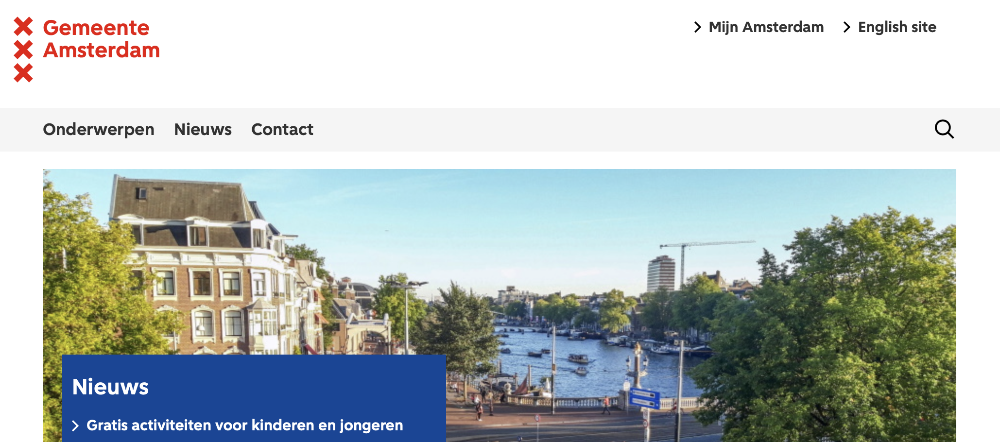

# Amsterdam.nl Web Scraper

Scripts to scrape contents (text and images) from www.amsterdam.nl and process the HTML into clean text files.

<figure align="center">
  
</figure>

## Background

These scripts are designed to scrape and process the contents of the Amsterdam.nl website, extracting text and images for analysis and archival purposes. The project makes use of asynchronous requests to efficiently handle multiple pages and resources.

## Folder Structure

 * [`scripts`](./sripts) _Scraper scripts_

## Installation

1. Clone this repository:

    ```bash
    git clone https://github.com/Amsterdam-AI-Team/amsterdam-nl-website-scraper.git
    ```

2. Install all dependencies:

    ```bash
    pip install -r requirements.txt
    ```

The code has been tested with Python 3.10.0 on Linux/MacOS/Windows.

## Usage

### Step 1: Navigate to scripts

First, navigate to the scripts directory:

```bash
cd scripts
```

This will download and save all HTML pages and images from the specified URLs into designated directories.

### Step 2: Scrape HTML and Images

Second, run the `scrape_amsterdam_nl.py` script to scrape HTML pages and images from the Amsterdam.nl website:

```bash
python3 scrape_amsterdam_nl.py
```

This will download and save all HTML pages and images from the specified URLs into designated directories.

### Step 3: Convert HTML to Text

Third, after scraping, run the `html_to_txt.py` script to convert the downloaded HTML pages into clean text files:

```bash
python3 html_to_txt.py
```

This will process the HTML files, extracting the main content and saving it as text files.

## Contributing

Feel free to help out! [Open an issue](https://github.com/Amsterdam-AI-Team/amsterdam-nl-website-scraper/issues), submit a [PR](https://github.com/Amsterdam-AI-Team/amsterdam-nl-website-scraper/pulls) or [contact us](https://amsterdamintelligence.com/contact/).


## Acknowledgements

This repository was created by [Amsterdam Intelligence](https://amsterdamintelligence.com/) for the City of Amsterdam.

## License 

This project is licensed under the terms of the European Union Public License 1.2 (EUPL-1.2).

